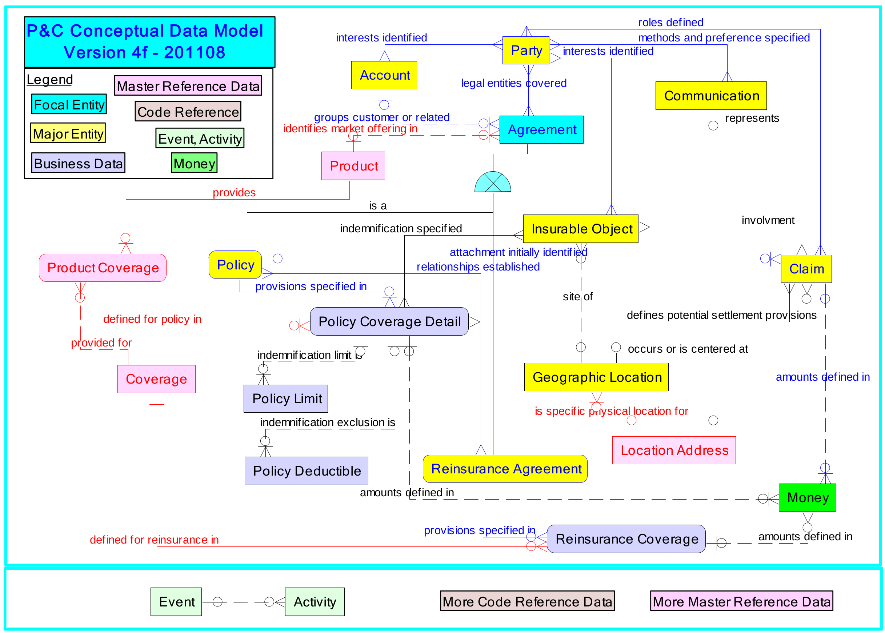

# PCDM - RDBMS - MySQL Modification
~~[](https://badge.fury.io/py/pcdm)~~

### This version is NOT released on PyPI 

This version has been updated for an ENV driven build thru the deploy_sql.py file. The SQLAlchemy build has also been modified to work with MySQL/MariaDB. Nothing major has been changed besides that. 

You probably know what you're doing if you're messing with this, so hopefully you don't need support. 🙂

### Known Issues

1. **Failed foreign key constraint**
[party.py#L844](https://github.com/KasemOmary/PCDM/blob/269f5bed2e216cf79ffa5c12008527852c5c49e5/pcdm/party.py#L844)
[party.py#L871](https://github.com/KasemOmary/PCDM/blob/269f5bed2e216cf79ffa5c12008527852c5c49e5/pcdm/party.py#L871)

Due to some odd issue with `relationship_type_code` & `relationship_begin_date` - an error is popping up on build.

This is a DB error and not an error with SQLAlchemy. Following is the error message:

```sh
sqlalchemy.exc.DatabaseError: (mysql.connector.errors.DatabaseError) 1822 (HY000): Failed to add the foreign key constraint. Missing index for constraint 'party_relationship_role_ibfk_3' in the referenced table 'party_relationship'
[SQL:
CREATE TABLE party_relationship_role (
        party_relationship_role_id INTEGER NOT NULL AUTO_INCREMENT,
        party_id INTEGER,
        related_party_id INTEGER,
        relationship_type_code VARCHAR(10),
        relationship_begin_date DATE,
        party_role_code VARCHAR(10),
        role_begin_date DATE,
        PRIMARY KEY (party_relationship_role_id),
        FOREIGN KEY(party_id) REFERENCES party_relationship (party_id),
        FOREIGN KEY(related_party_id) REFERENCES party_relationship (related_party_id),
        FOREIGN KEY(relationship_begin_date) REFERENCES party_relationship (begin_date),
        FOREIGN KEY(party_role_code) REFERENCES party_role (party_role_code)
)
```

### Property Casualty Data Model

PCDM is a [SQLAlchemy](https://www.sqlalchemy.org/) implementation of [Object Management Group's Property Casualty Data Model](https://www.omg.org/spec/PC/About-PC/). The Property Casualty Data Model is a relational database schema that closely resembles the backend of an insurance company. This package allows you to deploy a SQLite database within seconds for testing, and can be tweaked to support Postgres and other relational database systems.

PCDM contains 256 tables from 13 subject area models (SAMs):

1. Party - all persons, organizations, and groups involved in the insurance agreement
2. Account and Agreement - customer, insurer, and vendor agreements
3. Policy - policy information
4. Claim - claim information
5. Assessment - information pertaining to assesment (credit scoring, appraisals)
6. Agreement Role - roles involved in agreements (providers, producers, suppliers)
7. Claim Role - roles involved in claims (claimaints, adjusters)
8. Staffing Role - roles involved in staffing (employees and contractors)
9. Party Subtype - groupings and subgroupings of parties
10. Insurable Object - things that can be insured (vehicles, structures)
11. Money - transaction information
12. Event - event information
13. Product - product information (line of business, limits, coverage)



## Distribution

According to the [Object Management Group](https://www.omg.org/gettingstarted/overview.htm#Free):

>Anyone can download specifications from the OMG website for free, write software implementations that conform to the specifications, and use them, give them away, or sell them. Neither OMG membership nor license is required for this.


## Installation and Deployment

This repository requires sqlalchemy, so install it if you don't have it:

```
pip3 install sqlalchemy
```

or
```
pip3 install -r requirements.txt
```

The file deploy_sqlite contains a script that can be used to deploy a SQLite database:

```
git clone https://github.com/genedan/PCDM
cd PCDM
python3 deploy_sqlite.py
```

## PyPI

This package is also available on PyPI:

```
pip3 install pcdm
```
